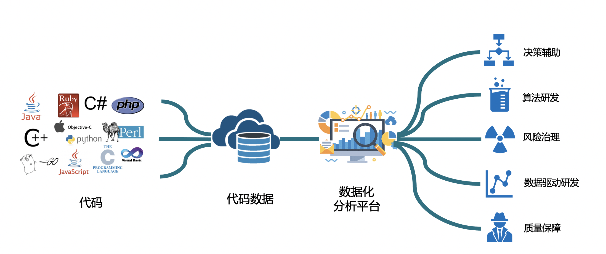
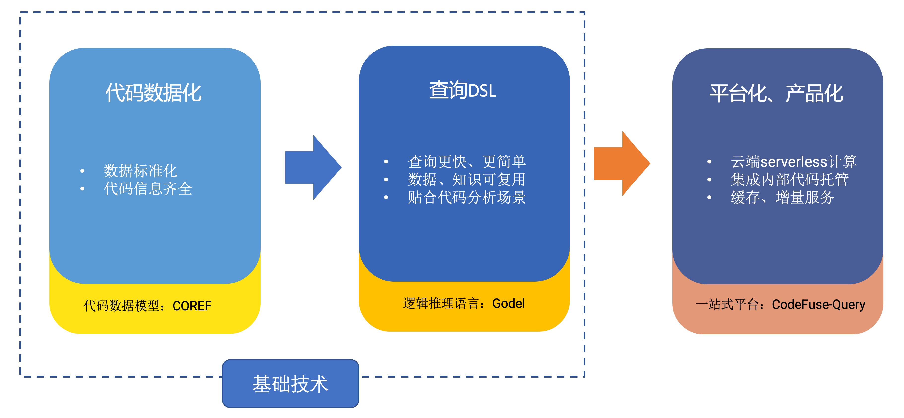
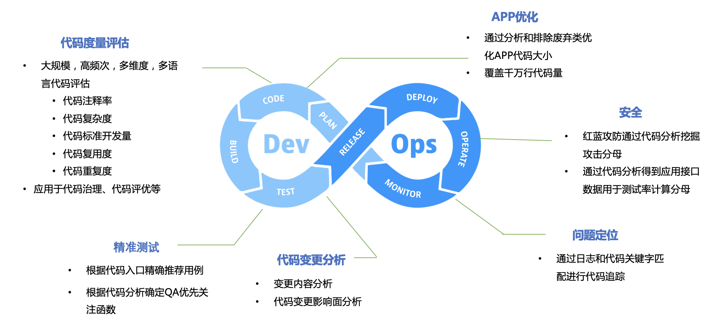

# Introduction
CodeFuse-Query is a code data platform that supports structured analysis of various programming languages. The core idea is to transform all code into data using various language parsers and to store this data in a structured format within a code database. Data analysis is then performed according to business needs using a custom query language, as shown in the diagram below:


## 2.1 Architecture of CodeFuse-Query
Overall, the CodeFuse-Query code data platform is divided into three main parts: the code data model, the code query DSL (Domain-Specific Language), and platform productization services. The main workflow is illustrated in the following diagram:
### 

### Code Datafication and Standardization: COREF
We have defined a model for code datafication and standardization called COREF, which requires all code to be converted to this model through various language extractors.
COREF mainly includes the following information:
**COREF** = AST (Abstract Syntax Tree) + ASG (Abstract Semantic Graph) + CFG (Control Flow Graph) + PDG (Program Dependency Graph) + Call Graph + Class Hierarchy + Documentation (Documentation/Commentary Information)
Note: As the computational complexity of each type of information varies, not all languages' COREF information includes all of the above. The basic information mainly includes AST, ASG, Call Graph, Class Hierarchy, and Documentation, while other information (CFG and PDG) is still under development and will be gradually supported.
### Code Query DSL
Based on the generated COREF code data, CodeFuse-Query uses a custom DSL language called **Gödel** for querying, thereby fulfilling code analysis requirements.
Gödel is a logic-based reasoning language, whose underlying implementation is based on the logical reasoning language Datalog. By describing "facts" and "rules," the program can continuously derive new facts. Gödel is also a declarative language, focusing more on describing "what is needed" and leaving the implementation to the computational engine.
Since code has already been converted to relational data (COREF data stored in the form of relational tables), one might wonder why not use SQL directly, or use an SDK instead of learning a new DSL language. Because Datalog's computation is monotonic and terminating. Simply put, Datalog sacrifices expressiveness to achieve higher performance, and Gödel inherits this feature.

- Compared to SDKs, Gödel's main advantage is its ease of learning and use. As a declarative language, users do not need to focus on intermediate computations and can simply describe their needs as they would with SQL.
- Compared to SQL, Gödel's advantages are stronger descriptive capabilities and faster computation speed, for example, describing recursive algorithms and multi-table joint queries, which are difficult for SQL.
### Platformization and Productization
CodeFuse-Query includes the **Sparrow CLI** and the online service **Query Centre**. Sparrow CLI contains all components and dependencies, such as extractors, data models, compilers, etc., and users can completely generate and query code data locally using Sparrow CLI (for how to use Sparrow CLI, please see Section 3: Installation, Configuration, Running). If users have online query needs, they can use the Query Centre to experiment.
## 2.2 Languages Supported by CodeFuse-Query for Analysis
As of October 31, 2023, CodeFuse-Query supports data analysis for 11 programming languages. Among these, support for 5 languages (Java, JavaScript, TypeScript, XML, Go) is very mature, while support for the remaining 6 languages (Objective-C, C++, Python3, Swift, SQL, Properties) is in beta and has room for further improvement. The specific support status is shown in the table below:

| Language      | Status | Number of Nodes in the COREF Model |
| ------------- | ------ | ---------------------------------- |
| Java          | Mature | 162                                |
| XML           | Mature | 12                                 |
| TS/JS         | Mature | 392                                |
| Go            | Mature | 40                                 |
| OC/C++        | Beta   | 53/397                             |
| Python3       | Beta   | 93                                 |
| Swift         | Beta   | 248                                |
| SQL           | Beta   | 750                                |
| Properties    | Beta   | 9                                  |

Note: The maturity level of the language status above is determined based on the types of information included in COREF and the actual implementation. Except for OC/C++, all languages support complete AST information and Documentation. For example, COREF for Java also supports ASG, Call Graph, Class Hierarchy, and some CFG information.
## 2.3 Use Cases of CodeFuse-Query
### Querying Code Features
A developer wants to know which String type variables are used in Repo A, so they write a Gödel script as follows and submit it to the CodeFuse-Query system for results.
```rust
// script
use coref::java::*

fn out(var: string) -> bool {
  for(v in Variable(JavaDB::load("coref_java_src.db"))) {
    if (v.getType().getName() = "String" && var = v.getName()) {
      return true
    }
  }
}

fn main() {
  output(out())
}
```
Similar needs: Queries for classes, functions, variables, return values, call graphs, class inheritance, etc.

### Outputting Static Analysis Capabilities
A security team member sets up **a system** to cross-verify that log data and code data are consistent. To complete a certain analysis task, they plan to derive static data D1 through Gödel queries, merge with dynamic data D2, and combine analysis to reach conclusion C. After verifying the technical feasibility on CodeFuse-Query, they integrate the system using the standard API provided by CodeFuse-Query.
Similar needs: Using static analysis as a system checkpoint, improving testing efficiency, merging the analyzed data into a documentation.
### Code Rule Checker
A team lead finds that the team often introduces similar bugs, Bug A, **and decides to establish a code rule and its checker** to be applied during CodeReview. After writing an analysis query on the CodeFuse-Query platform and testing that it meets requirements, they codify the query as a code rule and roll it out to the CodeReview/CI phase. Since then, this bug has never occurred again.
Similar needs: Writing static defect scanning rules to intercept code risks.
### Analyzing Code Characteristics
A developer from the R&D department wants to know the current proportion of Spring and Spring Boot projects in the code repository to quantify the promotion of the new framework. By writing a Gödel Query to describe different project analysis features, they **queried 110,000 code repositories at once** and obtained all the code data after a few dozen minutes, happily moving on to their KPIs.
Similar needs: Application profiling, code profiling, architectural analysis.
### Getting Statistical Data
A researcher finds that traditional code complexity metrics struggle to accurately measure the complexity of the code. Inspired by international advanced experiences and a moment of insight, they design a set of complexity metrics and algorithms. After implementing it with Gödel and finding it already highly performant with little optimization, they quickly apply it to over 10 languages and more than 110,000 repositories. They now have an in-depth understanding of the overall complexity of the code repositories, unlike before when they had to parse the code and analyze the syntax tree themselves, **which is so much more convenient**.
Similar needs: Code statistics, code metrics, algorithm design, academic research.
### Architectural Analysis
An architect recently promoted a new message middleware based on txt files, and existing analysis platforms couldn't support analyzing dependencies in such systems. By quickly modeling the message format with Gödel, they soon obtain the dependency relationships between different components in the system.
Similar needs: System overview, architecture governance, lineage analysis.
### Model Validation
A developer designs a system that requires users to play games before claiming coupons. They describe **the model's validation logic** with Gödel, then use the CodeFuse-Query system to **ensure that both current and future system implementations** fully comply with the model. No longer worried about potential financial losses from the game!
Similar needs: System verification, network validation, permission verification.
## 2.4 Application Areas of CodeFuse-Query
Currently, CodeFuse-Query at Ant Group already supports **CodeFuse large language model data cleaning**, **code metrics evaluation**, **R&D risk control**, **privacy security analysis**, **code intelligence**, **terminal package size management**, and other scenarios with implemented applications, serving over a million monthly calls.


### High-Quality Code Data Cleaning - CodeFuse Large Code Model
The CodeFuse Large Code Model is a model by Ant Group for handling code-related issues and has been open-sourced. For the CodeFuse large language model, the quality of the training data directly affects the model's inference results. Low-quality code data can directly contaminate the language model's output, for example: the model might learn incorrect code patterns, generating erroneous code; if the data only contains code in a single programming language, the model might not adapt well to code in other languages.
To control the quality of code data entering the model and thereby improve the model's inferencing capabilities, we have drawn upon the Ant Group program analysis team's years of practical experience coupled with industry consensus to clarify the definition of high-quality code. We have also implemented automated, large-scale code data cleaning using existing program analysis technologies.
CodeFuse-Query provides the following data cleaning capabilities for the CodeFuse Large Code Model:

- High-quality code data cleaning: Clean code data, including vulnerability scanning for 7 languages (Python, Java, JavaScript, TypeScript, Go, C, C++), filtering by language type/star number, filtering out data with 0 valid lines of code, etc. We have currently accumulated about **2TB** of cleaned code data from GitHub and internally at Ant Group.
- Code Profiling: Implements high-performance, multi-dimensional automatic tagging for large-scale code, supporting **10** languages (Java, Scala, Kotlin, JavaScript, JSX, TypeScript, TSX, Vue, Python, Go), **77** common tags, **40** Ant-specific tags, totaling **117** tags. The current auto-tagging performance can reach **40MB/s**.
- Other Atomic Abilities
   - Advanced code feature extraction, including extraction of AST (Abstract Syntax Tree), DFG (Data Flow Graph), etc. The AST information has been used for SFT training with about 97% accuracy.
   - Code snippet identification, used for extracting code from text data, convenient for formatting or adding Markdown:
      - Text extraction of code: Extracting code block information from text, parsing main languages, function and class definitions, only verifying a binary problem, that is, verifying whether the text contains code blocks with about 83% accuracy.
      - Identifying the programming language of a code snippet: Identifying the programming language of any code snippet, supporting 30+ languages, with about 80% accuracy.
   - Code comment pair extraction: Supports extracting method-level comment-code pair information, covering **15** most popular languages on GitHub, used for Text To Code/Code To Text SFT training.
### Code Data Metrics - Guangmu
Guangmu is an internal product at Ant Group aimed at different R&D personnel and team managers, providing objective data and analysis results to assess code capabilities.
Guangmu offers individual code capability assessment reports, daily code capability metric data analysis, team code capability management, and code excellence award displays, all aimed at helping Ant Group's R&D engineers continuously improve code quality, reduce code debt, and enhance R&D efficiency in the long run.
CodeFuse-Query provides Guangmu with two types of capabilities:

- Code Evaluation Metrics: Code complexity, code annotation rate, standard development volume, etc.
- Code Excellence Metrics: Code reuse degree.
### Change Analysis - Youku Server-Side R&D Efficiency
The Youku Quality Assurance team started exploring server-side precision testing in 2023. After six months of technical sedimentation and system building, they established a precision testing system capable of **change content identification, change impact analysis, testing capability recommendation, and test coverage assessment**.
In this process, CodeFuse-Query can provide capabilities including:

- Analyzing the impacted objects based on code change content (file + line number): methods, entry points (HTTP entry, HSF entry), call routes (all call routes from the entry to the changed method), database operations (tables, types of operations).
- Enhancing the effectiveness and readiness of change analysis impact by combining the precise analysis capabilities of online dynamic call routes (method routes) and CodeFuse-Query static analysis call routes.

To date, Youku has integrated all core applications through CodeFuse-Query and based on static analysis data collection, has built a complete server-side code and traffic knowledge base.