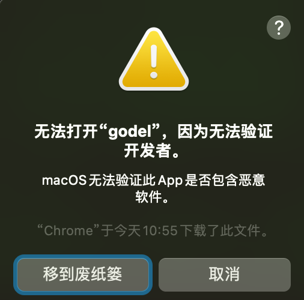
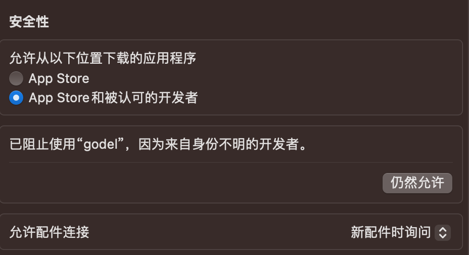

# Installation, Configuration, and Running

## Hardware and Software Requirements

- Hardware: 4C8G
  
- Environment Requirements: Java 1.8 and Python 3.8 or above runtime environments. Please ensure Java and Python executables are available.

## Sparrow Installation Steps and Guidance

- The CodeFuse-Query download package is a zip archive that contains tools, scripts, and various files specific to CodeFuse-Query. If you do not have a CodeFuse-Query license, downloading this archive indicates your agreement with the [CodeFuse-Query Terms and Conditions](../LICENSE).
- CodeFuse-Query is currently only supported on Mac and Linux systems. The download links are: (currently, only a sample is given, the official download link will be provided after open-source release)
   - Mac: [CodeFuse-Query 2.0.0](https://github.com/codefuse-ai/CodeFuse-Query/releases/tag/2.0.0)
   - Linux: [CodeFuse-Query 2.0.0](https://github.com/codefuse-ai/CodeFuse-Query/releases/tag/2.0.0)
- You should always use the CodeFuse-Query bundle to ensure version compatibility.

### Tips:

- On Mac systems, directly downloading the package may prompt a verification for the developer.



- You can modify the verification in the security settings.



- Click "Allow Anyway."

- For detailed steps, please refer to the [Mac Official Documentation: How to safely open an app on your Mac](https://support.apple.com/zh-cn/HT202491)

- Or use the `xattr -d com.apple.quarantine` command to remove the external attribute assigned to CodeFuse-Query by macOS.

- `xattr -d com.apple.quarantine` is a command-line instruction used to delete a file's `com.apple.quarantine` extended attribute. This attribute is used by the macOS system to mark files or applications downloaded from external sources to ensure security.

```java
xattr -d com.apple.quarantine path/to/file
```

## Configuring and Initializing the CodeFuse-Query Development Environment

- Unzip using the command line or by simply clicking to unzip.
  
- You need to have Java 8 and Python 3.8 or higher runtime environments.
  
- After unzipping CodeFuse-Query, you can run the Sparrow process by running the executable in the following ways:
  
- By executing `<extraction-root>/sparrow-cli/sparrow`, where `<extraction-root>` is the folder where you extracted the CodeFuse-Query package.

- By adding `<extraction-root>/sparrow-cli` to your PATH, so you can directly run the executable `sparrow`.

At this point, you can execute the `sparrow` command.

## Running

### Execution Steps

- Confirm the source code directory you need to query.

- Extract code data from the source code.

- Write a Gödel script based on the code data to obtain the desired code data.

- For how to write Gödel scripts, refer to [GödelScript Query Language](./4_godelscript_language.md)

### Execution Example

#### Data Extraction
```java
<extraction-root>/sparrow-cli/sparrow database create -s <src> -lang <language> -o <output>
```

- `<output>`: The output directory for the code data extracted from the codebase, referred to as `<database>` later.

- `<language>`: The language of the code to be extracted, fill in "java" for analyzing Java.

- `<src>`: The source code directory to be scanned.

- In the data extraction step, you obtain the database `<database>` required for executing the script.

#### Writing Gödel Scripts

- Assuming you have the following Gödel script to get all Java method names from a specified repository:

- For specific Gödel script writing, refer to [GödelScript Query Language](./4_godelscript_language.md)

```java
// script
use coref::java::*

// Define the global Java database
fn default_db() -> JavaDB {
    return JavaDB::load("coref_java_src.db")
}

// Iterate over all methods, get the method name, output limit
fn getFunctionName(name: string) -> bool {
    let (db = default_db()) {
        for (method in Method(db)) {
            if (name = method.getName()) {
                return true
            }
        }
    }
}


fn main() {
    output(getFunctionName())
}
```

#### Script Execution
```java
<extraction-root>/sparrow-cli/sparrow query run -d <database> -gdl <gdl_path> -o <output>
```

- `<database>`: The code data extracted from the codebase to be scanned, consistent with `<output>` above.

- `<gdl_path>`: The path where the Gödel script is located, fill in the directory path, and it will execute all files ending with `.gdl` in that directory in sequence.

- `<output>`: The output directory path, the result of executing xxx.gdl will be stored in `<output>/xxx.json` in JSON format.

- You can verify if the script executed correctly by checking the data file.

#### Example

Suppose there is the following Java code:

```java
public class HelloWorld {
    public static void main(String[] args) {
        HelloWorld tmp = new HelloWorld();
        String hello = tmp.getHello();
        String world = tmp.getWorld();
        System.out.println(hello + " " + world);
    }
    
    public String getHello() {
        return "Hello";
    }
    
    public String getWorld() {
        return "World";
    }
}

```

```java
sparrow database create -s <example> -lang java -o ./db/
sparrow query run -d ./db/ -gdl example.gdl -o ./
```

- `<example>` is the directory where the given Java file is stored.
  
- example.gdl is the given Gödel script sample, saved in the current directory.
  
- After execution, you can find the example.json file in the current directory.

The corresponding script output JSON file content is as follows:
```java
[{"name": "getHello"},
{"name": "getWorld"},
{"name": "main"}]

```