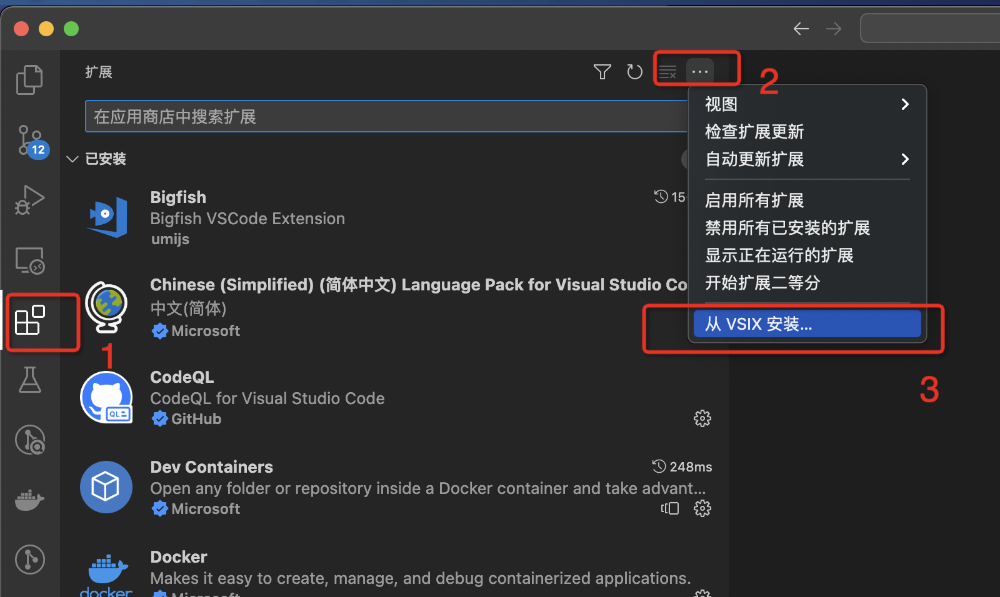
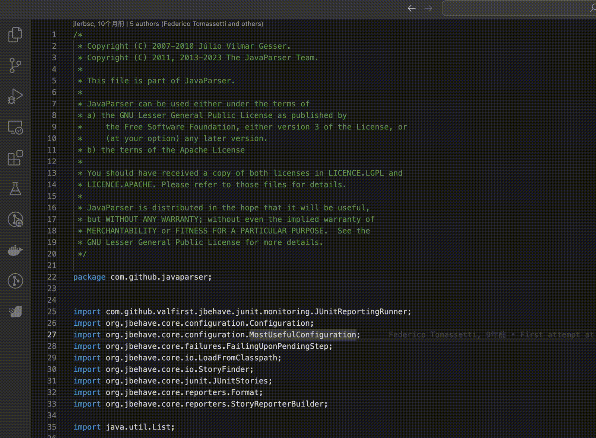
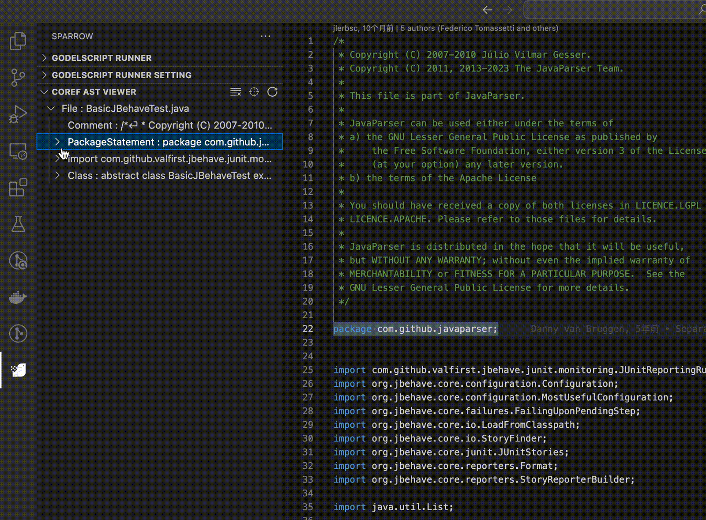
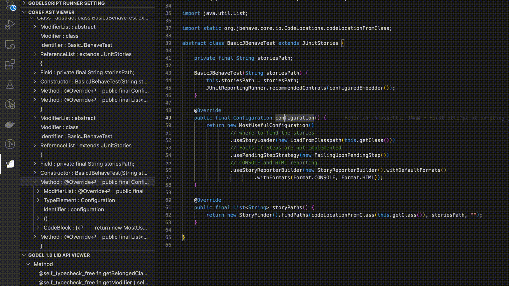
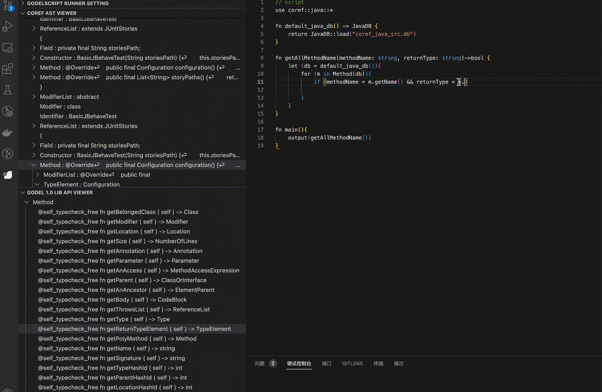
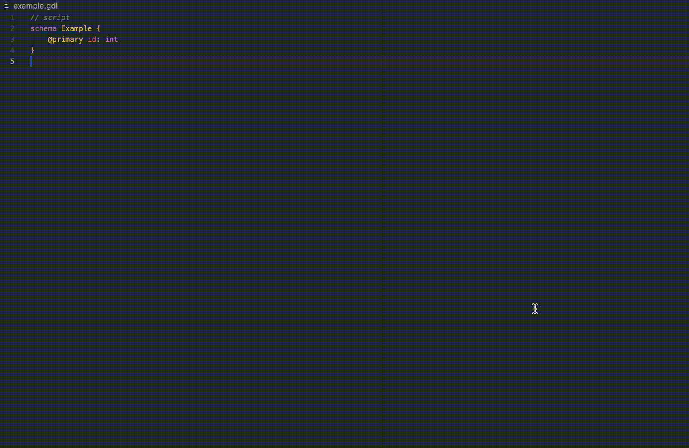
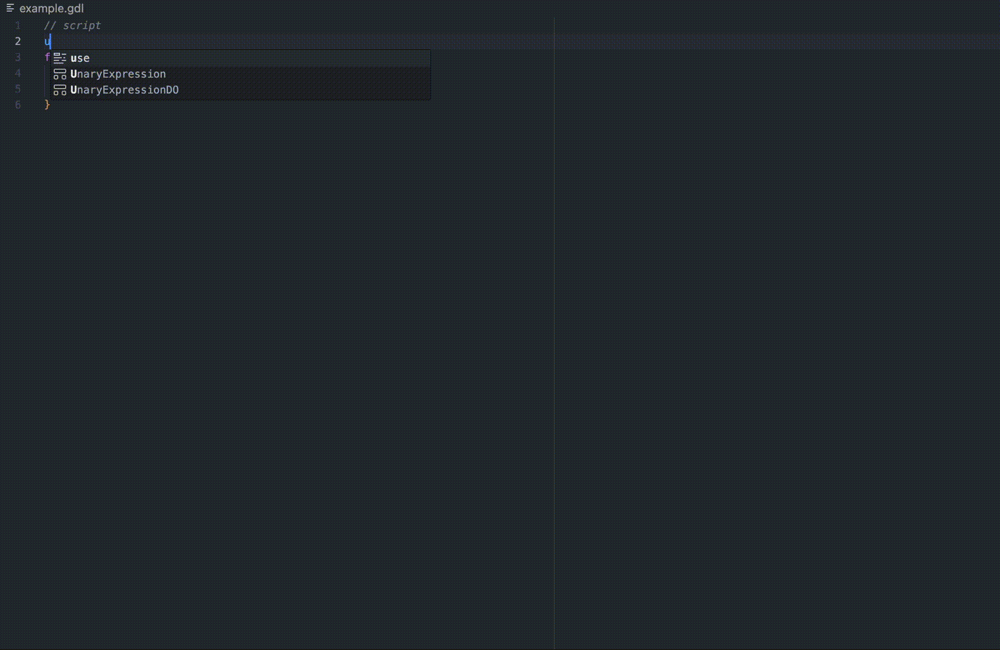
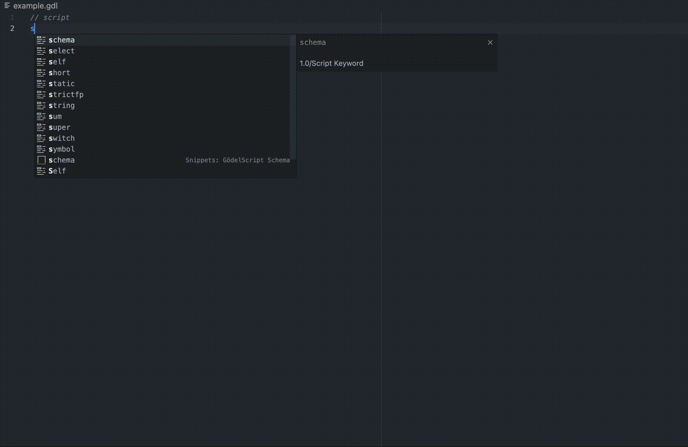
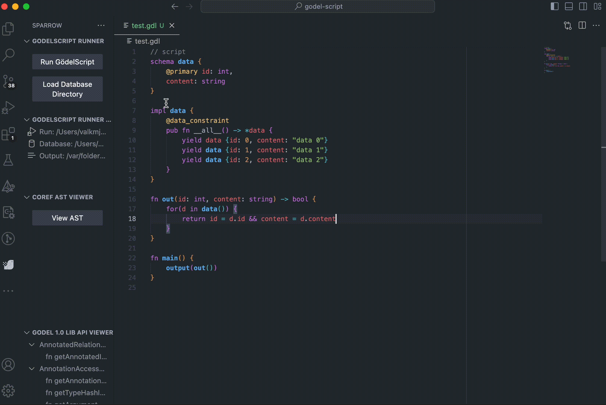

# Developing Plugins (VSCode)
## Installation
### Install from VSCode marketplace (Recommand)
[VSCode Extension](https://marketplace.visualstudio.com/items?itemName=CodeFuse-Query.codefuse-query-extension)
### Install from local via VSIX pack
1. Download the plugin.
2. Manually install from vsix:

3. Or use the command directly from the terminal to install:
```bash
code --install-extension [extension vsix file path]
```

## Environment Preparation

- Sparrow CLI, refer to Section 3 Installation, Configuration, and Running.
## Extension Features
This extension provides the following feature modules:

- COREF AST Viewer
- Gödel Language Server
- Gödel Language Runner
### COREF AST Viewer
The following features need to be enabled in the extension settings. Currently, it only supports the Java language.
#### Convert Java Files into Tree-Like COREF Nodes

#### Locate COREF Nodes and Code Positions Interactively

#### View Node APIs and Copy Nodes in Lib API Viewer

#### Lib API Viewer: Querying and Copying Usage

### Gödel Language Server Features
The following features need to be enabled after setting up the extension. Syntax highlighting is still available without setting related items.
#### Error Information Tips
Error information automatically updates with code changes.

#### Symbol Information Tips and Completion
Completion suggestions that include local variables and global symbols. Keywords provide corresponding usage examples; global symbol information offers more detailed internal information, such as member variables, member methods, and static methods.



- Keyword completion and usage example tips
- Local variable type information and symbol completion
- `.` followed by symbol information and completion
- `::` followed by symbol information and completion
- Annotation usage example tips
- Global symbol type information (internal structure, member methods, static methods)
#### Go to Definition
You can jump to definitions with a right-click or `ctrl`/`command`+`left click` to go directly to the exact symbol definition location.


#### Code Snippets (Snippets)
The extension provides some code snippets to quickly write Gödel 1.0/script code.


### GödelScript Runner
Use after setting the Sparrow CLI path in the extension. The database needs to be loaded before running the script. For how to generate a database, refer to Section 3.4, Running, in the data extraction part.
#### Running Scripts

There are four different script running buttons provided:
1. Right-click to execute at the script you want to run.
2. Choose `Run GödelScript` on the extension `GodelScript Runner` panel.
3. Choose `Run` on the extension `GodelScript Runner Setting` panel.
4. Click the run button at the top right of the extension `GodelScript Runner Setting` panel.
#### Database Folder Loading
1. Right-click at the script you want to run and choose the folder containing the database to load.
2. Choose `Load Database Directory` on the extension `GodelScript Runner` panel.
3. Choose `Database` on the extension `GodelScript Runner Setting` panel.
4. Click the database load button at the top right of the extension `GodelScript Runner Setting` panel.
## Extension Settings
### COREF AST Viewer Settings

- `corefASTViewer.sparrowCliRoot`
  - Specify the root directory of Sparrow CLI, referring to Section 3 of the installation part.
### Gödel Language Server Settings
When the extension starts, a prompt will pop up if any one of the following two items is not set. Clicking the `configure` button will redirect to the respective configuration page.

- `godelScript.executablePath`
  - Used to specify the executable path of GödelScript, default is empty. Please replace with the actual absolute path of the GödelScript executable when needed.
  - If Sparrow CLI is already downloaded, then the GödelScript executable file is `[sparrow cli root]/godel-script/usr/bin/godel`.
- `godelScript.libraryDirectoryPath`
  - Used to specify the library folder path of GödelScript, default is empty. Please replace with the absolute path of the GödelScript library folder when needed.
  - If Sparrow CLI is already downloaded, then the library folder path is `[sparrow cli root]/lib-1.0`.

# Smart Assistant

Stay tuned for the opening!